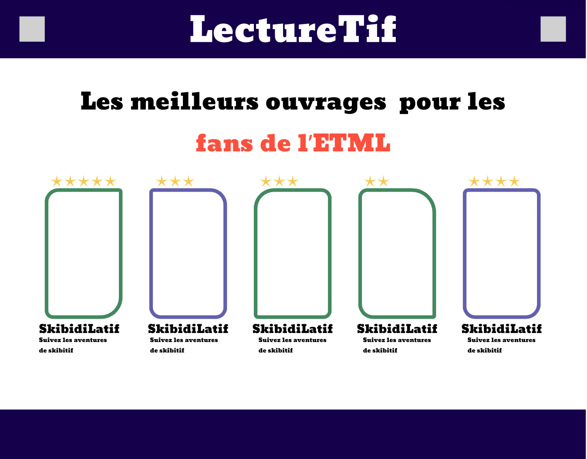
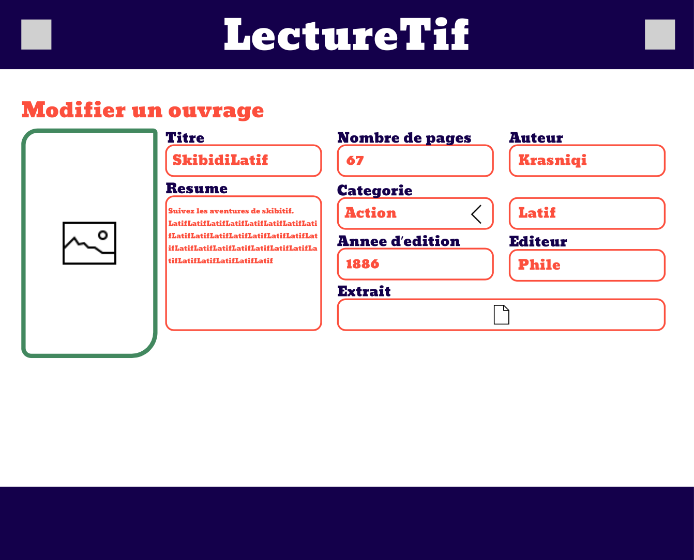
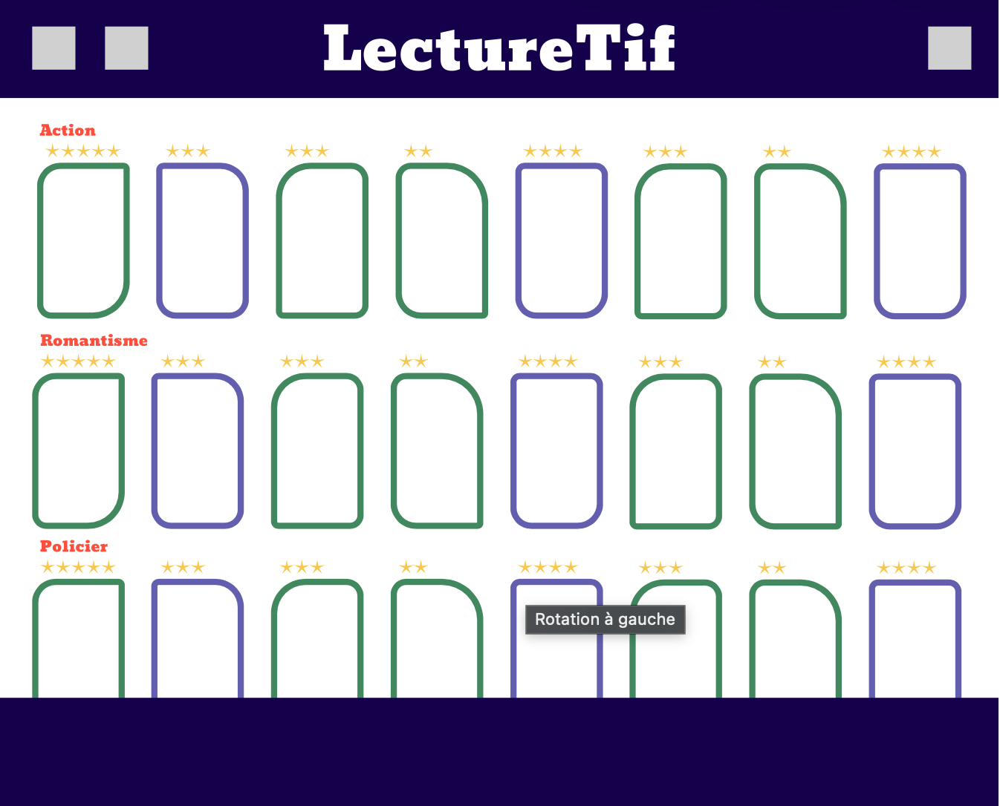
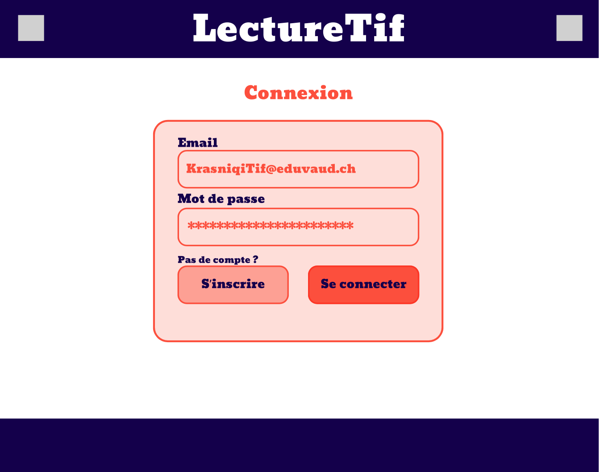
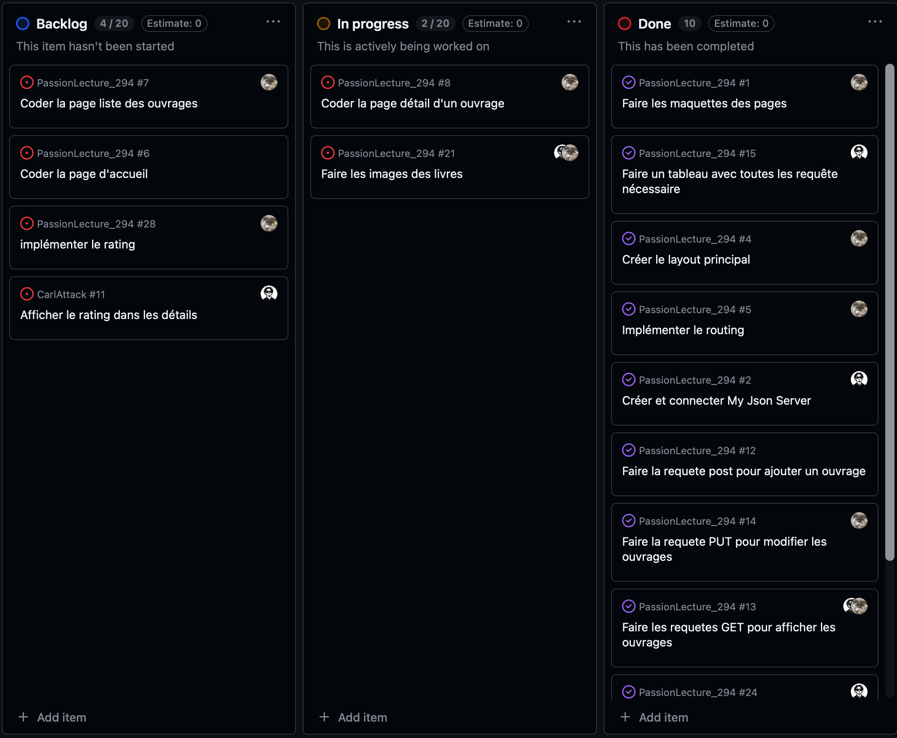

<div align="center">
    <h1>PassionLecture_294<h1/>
    
    <br>
    <br>
    <br>
</div>

<div align="center">
    Auteurs : Latif KRASNIQI, David SOTTAS<br>
    ETML - Vennes<br>
    Durée du projet : 32p<br>
    Chef de projet : Grégory CHARMIER
</div><br><br>

## Table des Matières
1. [Introduction](#introduction)
2. [Analyse](#analyse)
3. [Reéalisation](#réalisation)
4. [Conclusion](#conclusion)

## Introduction

Nous avons fais un site qui s'intitule : Passion Lecture. C'est un site qui permet de poster des ouvrages de tout type pour que les gens puissent les noter et mettre des commentaires. il est possible d'ajouter un ouvrage, le modifier et le supprimer. Le site est codé en Vue.js avec une simulation de backend en utilisant json-server.

## Analyse

### Maquettes


<br>

Notre page d'accueil contenant un titre et  les 5 derniers ouvrages (cliquables). les ouvrages ont un titre une petite descripition et une note.


<br>

Cette page s'affiche quand on clique sur un livre. il y la note, les informations sur le livre, les avis et un bouton pour ajouter un avis.


<br>

Une page avec un formulaire pour modifier les informations d'un livre. Il y a une page similaire pour ajouter des livres.


<br>

Une page avec tout les livres trié par catégories.


<br>

Une page pour voir les livre posté par sois même.


<br>

Une page pour ce connecter.


<br>

Une page pour créer un compte.


<br>

un formulaire pour ajouter un avis sur un livre.

### Planification des tâches

Nous avons écris pleins de tâches au tout debut du projet et les avons assigné au fur et à mesure que le projet avançait. Nous avons biensur ajouté de nouvelles tâches au cours du projet.



### Structure du code

Nous avons repris la structure de base en ajoutant de nouveaux fichiers .vue dans le dossier : ```PassionLecture/src/views``` pour avoir un nombre de page en corrélation avec nos maquettes. nous avons 2 services présents dans le dossier : ```PassionLecture/src/services``` un service sert à faire les requêtes HTTP pour les livres et l'autre pour les avis. Nous avons 2 components présents dans le dossier : ```PassionLecture/src/components``` qui sont le header et le footer car ils sont présent dans toute les pages. nous avons des routes présentes dans le dossier : ```PassionLecture/src/router``` qui permettent de redirigier les utilisateurs vers les differents composants en mettant par exemple sur un bouton :
```html
<router-link :to={ name: "composant" } >(Code du bouton html)</router-link>
```

### Analyse des routes

| **Nom** | **Verbe HTTP** | **URL** | **Envoyer du JSON** |
| :--- | :--- | :--- | :--- |
| **Récuperer tout les livres** | ```GET``` | ```/api/books``` | ```NON``` |
| **Modifier un livre** | ```PUT``` | ```/api/books/:id``` | ```OUI``` |
| **Ajouter un livre** | ```POST``` | ```/api/books``` | ```OUI``` |
| **Supprimer un livre** | ```DELETE``` | ```/api/books/:id``` | ```NON``` |
| **Voir les details d'un livre** | ```GET``` | ```/api/books/:id``` | ```NON``` |
| **Ajouter un avis** | ```POST``` | ```/api/books/:id/reviews``` | ```OUI``` |
| **Modifier un avis** | ```PUT``` | ```/api/books/:id/reviews``` | ```OUI``` |
| **Ajouter un auteur** | ```POST``` | ```/api/authors``` | ```OUI``` |
| **Voir les auteurs** | ```GET``` | ```/api/authors``` | ```NON``` |
| **Supprimer un auteur** | ```DELETE``` | ```/api/authors/:id``` | ```NON``` |

## Réalisation

### Fonctionnalités

Pour afficher les livres sur la page d'accueil, nous faisons appel à un service qui effectue une requête ```GET``` sur tous les livres, en utilisant un ```v-if``` dans la partie HTML pour afficher les 5 derniers.

Pour afficher tous les livres, on fait simplement appel au même service qu'avant.

Pour ajouter un livre, on fait appel à un service qui effectue une requête ```POST```, ensuite on fait des liaisons bidirectionnelles avec des ```v-model``` sur le formulaire.

Pour modifier un livre, on fait d'abord appel un service qui fait une requête ```GET``` pour recuperer les infos du livre ensuite on fait appel à un service qui effectue une requête ```PUT```, ensuite, comme avant, on fait des liaisons bidirectionnelles avec des ```v-model``` sur le formulaire.

Pour supprimer un livre, il y a un bouton "supprimer" qui va appeler une fonction qui va non seulement ouvrir une fenêtre de confirmation, mais aussi récupérer l'ID du livre. Ensuite, le bouton "supprimer" dans la fenêtre de confirmation appelle une fonction qui fait appel à un service qui effectue une requête ```DELETE```.

Pour afficher les détails d'un livre, on fait appel à un service qui effectue une requête ```GET``` avec en paramètre l'ID du livre pour afficher le bon livre. Dans les détails on affiche les avis avec un service qui fait une requête ```GET```.

Pour ajouter un avis et une note c'est comme pour les livres, on fait appel à un service qui fait une requête ```POST```et on fait des lisaisons bidirectionnelle avec des ```v-model``` sur le form.

Pour modifier un avis on fait comme pour les livres on fait appel à un service qui fait 


### Git

Pour optimiser notre organisation sur Git, nous nous coordonnons d'abord sur la répartition des tâches. Chacun travaille ensuite sur sa propre branche afin d'éviter tout conflit lors des commits intermédiaires.

Lorsqu'un de nous termine sa tâche, il ouvre une Pull Request pour merge son code (le premier merge se fait normalement sans problème). En revanche, lorsque l'autre termine, des conflits peuvent apparaître : dans ce cas, nous effectuons une revue à deux pour analyser et résoudre les conflits ensemble avant de valider le merge.

## Conclusion

### Conclusion générale

### Conclusion personnelle

#### Conclusion de Latif
#### Conclusion de David

### Critique de la planification